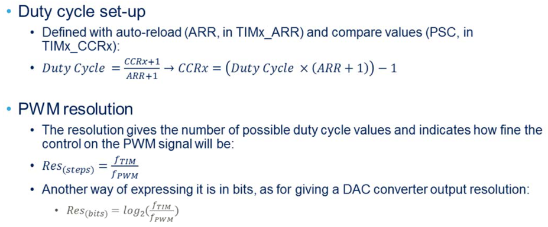

- [Porting freertos](#porting-freertos)
  - [Priority](#priority)
  - [Set other timer for timebase source for HAL_Delay()](#set-other-timer-for-timebase-source-for-hal_delay)
  - [Copy source files from RTOS source code](#copy-source-files-from-rtos-source-code)
  - [Add include directory](#add-include-directory)
  - [Add all source files under FreeRTOS](#add-all-source-files-under-freertos)
  - [Modify "Core\Src\stm32f4xx_it.c"](#modify-coresrcstm32f4xx_itc)
  - [References:](#references)
- [UART communication](#uart-communication)
  - [Polling](#polling)
  - [DMA](#dma)
  - [Redirect the printf to UART in GCC](#redirect-the-printf-to-uart-in-gcc)
  - [References](#references-1)
- [PWM](#pwm)
  - [References](#references-2)
- [DMA](#dma-1)


# Porting freertos
## Priority
- From 0 to ( configMAX_PRIORITIES - 1 ), where configMAX_PRIORITIES is defined within FreeRTOSConfig.h
- Low priority numbers denote low priority tasks
## Set other timer for timebase source for HAL_Delay()

## Copy source files from RTOS source code
- Copy all *.c from FreeRTOS\Source to FreeRTOS\src
- Copy FreeRTOS\Source\portable\MemMang\heap_4.c to FreeRTOS\port
- Copy all files from FreeRTOS\Source\portable\GCC\ARM_CM4F to FreeRTOS\port
- Copy necessary FreeRTOSConfig.h to your include directory
## Add include directory 
- FreeRTOS\port
- FreeRTOS\include
## Add all source files under FreeRTOS
- tbd
## Modify "Core\Src\stm32f4xx_it.c"
- Add the following includes:
```
#include "stdio.h"
#include "stm32f4xx.h"
```
- comment 
```
  SVC_Handler(void)
  PendSV_Handler(void)
```
- modify SysTick_Handler(void)
```
void SysTick_Handler(void)
{
  /* USER CODE BEGIN SysTick_IRQn 0 */
#if (INCLUDE_xTaskGetSchedulerState == 1)
  if (xTaskGetSchedulerState() != taskSCHEDULER_NOT_STARTED)
  {
#endif /* INCLUDE_xTaskGetSchedulerState */
    xPortSysTickHandler();
#if (INCLUDE_xTaskGetSchedulerState == 1)
  }
#endif 
  /* USER CODE END SysTick_IRQn 0 */

  /* USER CODE BEGIN SysTick_IRQn 1 */

  /* USER CODE END SysTick_IRQn 1 */
}
```


## References:
- [Using Visual Studio Code for FreeRTOS development](https://www.freertos.org/2021/01/using-visual-studio-code-for-freertos-development.html?utm_source=pocket_mylist)
- [Cortex-Debug extension](https://github.com/Marus/cortex-debug/wiki)
- [Modifying a FreeRTOS Demo](https://www.freertos.org/porting-a-freertos-demo-to-different-hardware.html)
- [freertos Customisation](https://www.freertos.org/a00110.html)
- [使用其他計時器作為HAL的基礎時鐘](https://blog.csdn.net/HongAndYi/article/details/103414576)
- [freertos学习02-队列 stream buffer message buffer](https://blog.csdn.net/sinat_36568888/article/details/124339998)
- [read line by line from buffer](https://stackoverflow.com/questions/10560505/how-to-read-line-by-line-after-i-read-a-text-into-a-buffer)
```
char * line = strtok(buffer, "\n");
while(line) 
{
   printf("%s", line);
   line  = strtok(NULL, "\n");
}
```

<br />
<br />

---
# UART communication


- USARTDIV is the divide factor to generate different baud rates
## Polling
## DMA
- 初始化先執行the folling, 開始接收
```
HAL_UART_Receive_DMA(huart, uart_rx_dma_buffer, UART_DMA_RX_LEGNTH)
// Enable Idle interrupt
__HAL_UART_CLEAR_IDLEFLAG(huart);
__HAL_UART_ENABLE_IT(huart, UART_IT_IDLE);

```
- 接收後再執行一次,等待下一筆資料
```
  __HAL_UART_CLEAR_IDLEFLAG(huart);

  // check received byte count
  uint8_t rxCount
      = UART_DMA_RX_LEGNTH - __HAL_DMA_GET_COUNTER(huart->hdmarx);

  if (rxCount > 0)
  {
    // save UART data(uart_rx_dma_buffer)  to stream buffer
  }

  // reset DMA
  HAL_UART_DMAStop(huart);
  memset(uart_rx_dma_buffer, 0, sizeof(uart_rx_dma_buffer));
  HAL_UART_Receive_DMA(huart, uart_rx_dma_buffer, UART_DMA_RX_LEGNTH);
```
## Redirect the printf to UART in GCC
The arm-none-eabi- toolchain is using newlib, which lets you redefine _write(int fd, const void *buf, size_t count) instead, all stdio output functions would then use that interface
```
#if defined(__GNUC__)
int _write(int fd, char * ptr, int len)
{
  HAL_UART_Transmit(&huart1, (uint8_t *) ptr, len, HAL_MAX_DELAY);
  /* For DMA transfer */
  //HAL_UART_Transmit_DMA(&huart1, (uint8_t *)ptr, len); 
  return len;
}
#endif
```
## References
- [STM32 HAL 串口DMA 接收不定长以及printf和scanf ](https://blog.csdn.net/zhaqonianzhu/article/details/99676829)
- - [STM32 printf retarget to UART](https://gist.github.com/glegrain/ca92f631e578450a933c67ac3497b4df)
- [STM32 自定义printf，使用DMA打印](https://blog.csdn.net/liangbin414/article/details/111467045)
- [USART Baud rate calculation](http://fastbitlab.com/stm32-usart-lecture-8-usart-baud-rate-calculation-part-2/) 

&nbsp;<br>
&nbsp;<br>


---
# PWM

  
  
  - Set PSC = actural value - 1
  ```
  __HAL_TIM_SET_PRESCALER(__HANDLE__, __PRESC__) 
  ```
  - Set ARR to actural period -1. 
  - actual period = (ARR + 1) * clock period
    - Counter: 0,1,2,3,4,5,6,...ARR, 0,1,2,3,4,5,...
```
__HAL_TIM_SET_AUTORELOAD(__HANDLE__, __AUTORELOAD__)
```
  - Set CCR to actual width
  ```
//__HAL_TIM_SET_COMPARE(__HANDLE__, __CHANNEL__, __COMPARE__)
__HAL_TIM_SET_COMPARE(&htim1, TIM_CHANNEL_1, pulse_width);
```

- Duty = CCR/(ARR+1)
- TIMx_CNT<TIMx_CCRx, the PWM signal reference OCxREF is high
- duty calculation wrong in the ST presentation
- Frequency = clock / (PSC + 1) /(ARR + 1)
- Set TIM_EGR_UG at the first time to update the ARR/CCR/PSC. After Init, don't set TIM_EGR_UG again when updating the ARR/CCR/PSC.
This will reset the counter. The ARR/CCR/PSC will be updated automatically on the next PWM update event.

  
## References
- [PWM with DMA in STM32](https://controllerstech.com/pwm-with-dma-in-stm32/)

- [Using STM32 HAL Timer and Adjusting the Duty Cycle of a PWM signal](https://stackoverflow.com/questions/43483762/using-stm32-hal-timer-and-adjusting-the-duty-cycle-of-a-pwm-signal)
- [Output PWM cycle and duty cycle](https://www.programmersought.com/article/71039984743/)
- [STM32 uses the HAL library to output continuously adjustable PWM signals](https://www.programmersought.com/article/68726509317/)
  - 提到如何連續改變frequency and duty cycle
- [stm32 定时器输出比较功能-PWM](https://chowdera.com/2022/03/202203251447424691.html)
- [STM32H7的定时器应用之TIM1-TIM17的PWM实现](https://www.cnblogs.com/armfly/p/11956167.html)


# DMA
